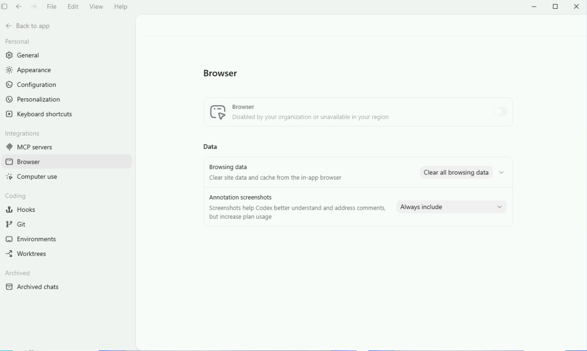
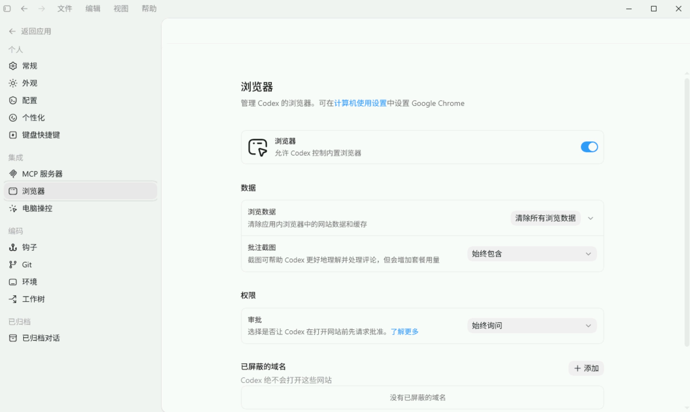
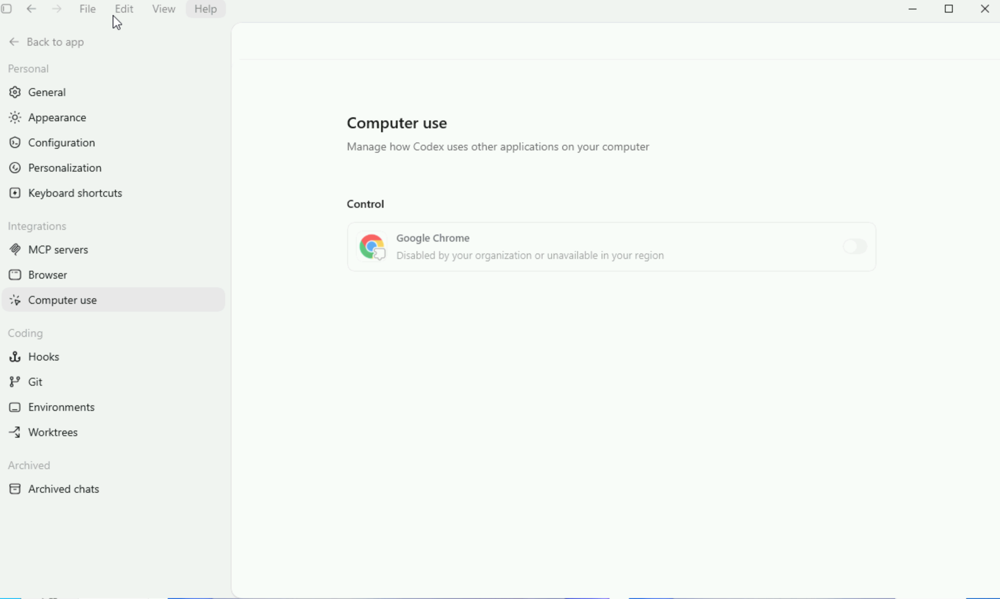
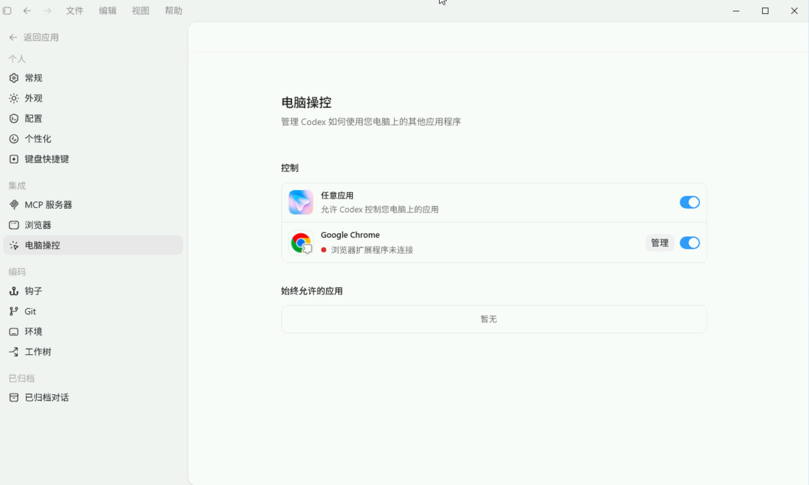

# Codex-ZH 中文版

Codex-ZH 是面向中文 Windows 用户的 Codex 定制版。它默认使用中文界面，内置中转站配置向导，并让 Browser、Chrome、Computer Use 等本地能力在国内 API Key 场景下也能正常启用。

不需要手动改 `config.toml`，也不需要理解 provider、`wire_api` 这些配置项。下载、安装、填 Key、测试连接，然后启动 Codex。

## 你可以用它做什么

| 需求 | Codex-ZH 的处理方式 |
| --- | --- |
| 想让 Codex 默认显示中文 | 安装后默认启用简体中文界面 |
| 想接入中转站 | 提供 Wokey、OpenRouter、自定义中转站模板 |
| 不会改配置文件 | 首次启动进入配置向导，填地址、Key、模型名即可 |
| 怕配置被覆盖 | 写入前自动备份，只合并 Codex-ZH 管理的字段 |
| Browser / Computer Use 地区不可用 | 内置本地能力配置，让入口可见、可安装、可启用 |

目前 v1 只支持 Windows x64。

## 下载

<!-- codex-zh-downloads:start -->
当前最新版：v0.1.1

| 你的系统 | 下载哪个版本 |
| --- | --- |
| Windows 10 / Windows 11（64 位） | [下载 Codex-ZH 0.1.1 Windows x64 安装包](https://github.com/focuxdot/codex-zh/releases/download/v0.1.1/OpenAI.Codex-26.608.1337.0%2BCodex-ZH-0.1.1-win-x64.exe) |
| macOS | 暂不提供 Codex-ZH 安装包，不要下载 Windows 版 |
| Linux | 暂不提供 Codex-ZH 安装包，不要下载 Windows 版 |

普通用户只需要下载上面的 `.exe` 文件。不要下载 GitHub 页面里的 `Source code`，那是源码，不是安装包。

校验文件：[`OpenAI.Codex-26.608.1337.0+Codex-ZH-0.1.1-win-x64.exe.sha256`](https://github.com/focuxdot/codex-zh/releases/download/v0.1.1/OpenAI.Codex-26.608.1337.0%2BCodex-ZH-0.1.1-win-x64.exe.sha256)  
SHA256：`54aadeb761320de0267a5636552ca1df90488b449f5c9a96781c92a8d6114651`
<!-- codex-zh-downloads:end -->

## 快速开始

1. 在上面的“下载”表格里，按你的系统下载 `.exe` 安装包。
2. 双击安装并打开 `Codex-ZH`。
3. 在配置向导里选择模板，填写中转站地址、API Key、模型名。
4. 点击“测试连接”。
5. 测试通过后点击“保存并启动”。

Wokey 模板会预填公开测试 Key，方便第一次验证流程。长期使用或生产使用，请换成自己的中转站 Key。

## 功能对比

### Browser

| 原版 Codex | Codex-ZH 中文版 |
| --- | --- |
|  |  |
| 部分地区会显示 Browser 不可用。 | 内置浏览器可以正常开启。 |

### Computer Use

| 原版 Codex | Codex-ZH 中文版 |
| --- | --- |
|  |  |
| Computer use / Chrome 控制可能被地区限制挡住。 | 可以开启“任意应用”和 Google Chrome。 |

## 中转站怎么填

如果你不熟悉这些字段，可以按下面理解：

| 字段 | 填什么 |
| --- | --- |
| 中转站地址 | 服务商给你的 API 地址，例如 `https://api.wokey.ai` 或 `https://openrouter.ai/api/v1` |
| API Key | 服务商后台复制出来的 Key |
| 模型名 | 服务商支持的模型名，例如 `auto`、`openai/gpt-4.1`、`gpt-4.1` |

高级字段默认不用管。Codex-ZH 会自动使用当前 Codex Desktop 需要的 `responses` 协议。

## 它会改哪些配置

Codex-ZH 会写入官方 Codex 配置目录里的 `config.toml`，但写入前会先备份。

它只管理这些内容：

- 当前模型
- 当前 provider
- 中转站 Base URL
- 中转站 API Key
- Codex 桌面的对话详情显示方式

你的其它 Codex 设置会保留。

## 常见问题

### 我不是开发者，可以用吗

可以。Codex-ZH 的目标用户就是普通 Windows 用户。你不需要知道 `config.toml` 在哪里，也不需要理解 `model_provider`。

### 没有中转站 Key 能试用吗

可以先用 Wokey 模板里的公开测试 Key 验证流程。长期使用建议换成自己的 Key。

### Browser 和 Computer Use 一定能用吗

Codex-ZH 会让入口可见、可安装、可启用，并内置必要的本地能力配置。Chrome 控制仍然需要你本机安装 Chrome，并按界面提示连接浏览器扩展。

### 会上传我的 API Key 吗

不会。API Key 写入你本机的 Codex 配置文件。日志和错误提示不应该输出完整 Key。

### 配置失败怎么办

通常是下面几类原因：

- API Key 填错。
- Base URL 少了 `/v1`，或服务商地址不兼容。
- 模型名不存在，或账号没有开通该模型。
- 中转站暂时不可用。

配置器会尽量给出能操作的提示，比如“检查 API Key”或“检查 Base URL”。

## 和原版 Codex 的关系

Codex-ZH 是在原版 Codex 的基础上做配置和资源定制：默认中文、预置中转站配置向导，并调整本地能力入口的可用性。

源码仓库只保存这些定制脚本和配置，不直接提交官方 Codex 的安装包或二进制文件。

项目不做这些事：

- 不破解官方账号。
- 不绕过官方认证、授权或 attestation。
- 不提供公共模型中转服务。
- 不把第三方私有 API Key 打进安装包。
- 不支持 macOS/Linux v1 安装包。

## 贡献

开发者和贡献者请看 [CONTRIBUTING.md](CONTRIBUTING.md)，发布边界请看 [OPEN_SOURCE_READINESS.md](OPEN_SOURCE_READINESS.md)。
