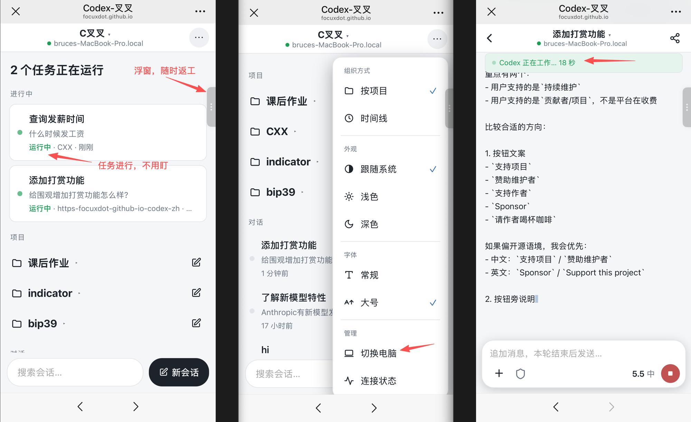

# Codex-ZH 中文版 · OpenAI Codex 中文增强版

Codex-ZH 中文版是 OpenAI Codex 的中文增强版，核心做三件事：

> 当前开发版已跟进官方桌面应用更名与大版本升级：底层基线为 ChatGPT 26.707.31428（内置 Codex CLI 0.144.0-alpha.4）。项目名称继续保留为「Codex-ZH 中文版」。

1. **说中文、国内能连**：默认中文界面，内置中转站配置向导（Wokey / OpenRouter / 自定义），免改 `config.toml` 就能在国内 API Key 场景下启用 Browser、Chrome、Computer Use 等本地能力。
2. **CXX 远程增强模块**：扫码配对后，微信变成电脑上 Codex 的遥控器——看进度、批命令、随时返工，人离开工位任务不停。
3. **会话围观**：一条只读链接，把你和 AI 协作的完整过程分享到群里，微信点开即看，无需安装。这是 Codex 生态（包括官方 App）目前没有的能力。

> 关键词：Codex 中文版、Codex 汉化、Codex 国内怎么用、Codex 手机远程控制、Codex 会话分享、Codex 中转站配置、Codex Windows 安装包、Codex Mac 版、Browser / Computer Use 地区不可用。

## 微信扫码直接使用：人离开电脑，任务不停

Codex 跑长任务时，你不必守在电脑前：

- **一眼看清全局**：首页大字看板直接回答“几个任务在跑、几个在等审批”。任务进行时不用盯，浮窗随时点开返工。
- **审批不回工位**：普通命令可“批准，且本会话内不再询问”。
- **完整的会话能力**：发消息、打断、接管、新建会话（常用目录点选即建）、Codex 回复 markdown 渲染、命令与 diff 逐条可查。
- **多台电脑**：家里、公司各一台？顶栏菜单一键切换，工作、私活做斜杠小登。
- **主动通知**：任务完成或需要审批时，推送到 Bark / Server酱 / 企业微信 / 钉钉（国内可用，不依赖 Web Push），通知带深链直达对应会话。

手机端是网页（PWA，可添加到主屏幕），微信扫码直接使用，无需安装 App，微信添加到悬浮窗，随时点开返工。

安全设计（细节见 [remote/PROTOCOL.md](remote/PROTOCOL.md)）：

Codex-ZH 中文版内置了 CXX 远程控制增强模块。macOS 版里点菜单栏的 Codex 图标 →「扫码配对手机」，手机扫码就连上了（首次扫码即自动开启远程，无需先手动启用）；不用则完全不运行。

CXX 已经独立为开源项目 [focuxdot/CXX](https://github.com/focuxdot/CXX)。在 Codex-ZH 中文版里，它是一个内置增强模块；如果你只需要单独安装远程控制功能，或想在 Codex-ZH 中文版之外使用同一套远程能力，请参考 [focuxdot/CXX](https://github.com/focuxdot/CXX) 的安装与部署说明。

## 会话围观：一条链接，请人看你和 AI 干活

会话是这个时代新的作品。Codex-ZH 中文版把一个会话变成可分享的只读链接：

- **跑完的会话从头回放**：精彩的重构、排障、从零到一，可以当作品集挂出去；小团队把项目会话给甲方看进度。
- **正在跑的会话实时围观**：同一条链接，会话在跑时自然变成直播——不是两个功能，是同一个视图的两种状态。
- **观众零门槛**：微信里点开就能看，不用安装任何东西；可以喝彩、复制你的 prompt、转发链接。
- **收放自如**：链接分 24 小时 / 永久两档，随时撤销，撤销瞬间全场踢出。

## 中文界面与国内可用

不需要手动改 `config.toml`，也不需要理解 provider、`wire_api` 这些配置项。下载、安装、填 Key、测试连接，然后启动 Codex。

| 需求 | Codex-ZH 中文版的处理方式 |
| --- | --- |
| 想让 Codex 默认显示中文 | 安装后默认启用简体中文界面 |
| 想接入中转站 | 提供 Wokey、OpenRouter、自定义中转站模板 |
| 不会改配置文件 | 首次启动进入配置向导，填地址、Key、模型名即可 |
| 怕配置被覆盖 | 写入前自动备份，只合并 Codex-ZH 中文版管理的字段 |
| Browser / Computer Use 地区不可用 | 内置本地能力配置，让入口可见、可安装、可启用 |
| 人不在电脑前 | 手机远程看进度、批命令、随时返工 |
| 想把会话分享给别人看 | 生成只读围观链接，点开即看 |

## 下载

<!-- codex-zh-downloads:start -->
当前最新版：v0.4.0

| 你的系统 | 下载哪个版本 |
| --- | --- |
| Windows 10 / Windows 11（64 位） | [下载 Codex-ZH 中文版 0.4.0 Windows x64 安装包](https://github.com/focuxdot/codex-zh/releases/download/v0.4.0/Codex-26.608.1337.0%2BZH-0.4.0-win-x64.exe) |
| macOS（Apple 芯片 / arm64） | [下载 Codex-ZH 中文版 0.4.0 macOS arm64 安装包](https://github.com/focuxdot/codex-zh/releases/download/v0.4.0/Codex-ZH-0.4.0-mac-arm64.dmg) |
| macOS（Intel / x64，macOS 12+） | [下载 Codex-ZH 中文版 0.4.0 macOS Intel x64 安装包](https://github.com/focuxdot/codex-zh/releases/download/v0.4.0/Codex-ZH-0.4.0-mac-x64.dmg) |

macOS 版打开时如果提示文件“已损坏”或无法安装，属正常现象，按[常见问题里的说明](#macos-打开时提示已损坏或无法验证开发者)处理即可。
<!-- codex-zh-downloads:end -->

## 快速开始

### Windows

1. 在上面的“下载”表格里下载 `.exe` 安装包，双击安装并打开 `Codex-ZH`。
2. 在配置向导里选择模板，填写中转站地址、API Key、模型名。
3. 点击“测试连接”，通过后点击“保存并启动”。

### macOS

1. 按你的 Mac 芯片下载对应 `.dmg`：Apple 芯片用 `mac-arm64`，Intel Mac 用 `mac-x64`（需要 macOS 12 或更新）。
2. 首次打开如果提示“已损坏”或“无法验证开发者”，打开「终端」执行一次 `xattr -d com.apple.quarantine "/Applications/Codex-叉叉.app"` 即可（原因和图形界面办法见常见问题）。
3. 打开 `Codex-ZH`，配置向导与 Windows 相同：选模板、填地址和 Key、测试连接。
4. 想用手机远程：点菜单栏的 Codex 图标 →「扫码配对手机」，手机扫码即连上（首次扫码自动开启远程）。如果只想独立安装远程控制功能，请使用 [focuxdot/CXX](https://github.com/focuxdot/CXX)。

macOS 版支持 Apple 芯片（arm64）和 Intel（x64，macOS 12+）。

Wokey 模板会预填公开测试 Key，方便第一次验证流程。长期使用或生产使用，请换成自己的中转站 Key。

如果你通过 CC-switch 等外部工具切换模型，不希望 Codex-ZH 中文版启动时打开中转站配置向导，可以在弹窗里勾选“以后不再显示这个配置弹窗”并点击“跳过本次”。启动器也支持 `CodexZhLauncher.exe --skip-config` 跳过本次配置向导；需要重新打开配置时，使用开始菜单里的“Codex 中转站配置”。

## 办公实战教程

Codex 高效办公实战课，原创“问补做”套路 · 真实办公案例。

先从教程总入口开始看：[Codex-ZH 中文版办公实战教程第一季](https://focuxdot.github.io/codex-zh/office-tutorials/)。

大纲参考[快刀青衣《Codex办公实战课》](https://mp.weixin.qq.com/s/A8Bn-B4u_9gEa5B_yHqo5A)，GPT-5.5 × Opus 4.8 共创完成。

| 教程 | 主题 |
| --- | --- |
| 01 | [开箱即用：整理混乱文件夹](https://focuxdot.github.io/codex-zh/office-tutorials/01-folder-cleanup.html) |
| 02 | [快速提案：散装资料变方案](https://focuxdot.github.io/codex-zh/office-tutorials/02-proposal-from-materials.html) |
| 03 | [数据清洗：乱报名表变统计数据](https://focuxdot.github.io/codex-zh/office-tutorials/03-data-cleaning.html) |
| 04 | [高效设计：一句想法变 PPT 初稿](https://focuxdot.github.io/codex-zh/office-tutorials/04-ppt-first-draft.html) |
| 05 | [从零造工具：CSV / Markdown 本地转换器](https://focuxdot.github.io/codex-zh/office-tutorials/05-format-converter.html) |
| 06 | [批量处理：一堆活动截图一次整理好](https://focuxdot.github.io/codex-zh/office-tutorials/06-batch-images.html) |
| 07 | [知识点到短视频：会员积分讲得不生硬](https://focuxdot.github.io/codex-zh/office-tutorials/07-knowledge-to-short-video.html) |
| 08 | [长素材到高光：直播回放拆成剪辑清单](https://focuxdot.github.io/codex-zh/office-tutorials/08-long-material-to-highlights.html) |

## 功能对比

### Browser

| 原版 Codex | Codex-ZH 中文版 |
| --- | --- |
|  |  |
| 部分地区会显示 Browser 不可用。 | 内置浏览器可以正常开启。 |

### Computer Use

| 原版 Codex | Codex-ZH 中文版 |
| --- | --- |
|  |  |
| Computer use / Chrome 控制可能被地区限制挡住。 | 可以开启“任意应用”和 Google Chrome。 |

## 中转站怎么填

如果你不熟悉这些字段，可以按下面理解：

| 字段 | 填什么 |
| --- | --- |
| 中转站地址 | 服务商给你的 API 地址，例如 `https://api.wokey.ai` 或 `https://openrouter.ai/api/v1` |
| API Key | 服务商后台复制出来的 Key |
| 模型名 | 服务商支持的模型名，例如 `auto`、`openai/gpt-4.1`、`gpt-4.1` |

高级字段默认不用管。Codex-ZH 中文版会自动使用当前 Codex Desktop 需要的 `responses` 协议。

## 它会改哪些配置

Codex-ZH 中文版会写入官方 Codex 配置目录里的 `config.toml`，但写入前会先备份。

它只管理这些内容：

- 当前模型
- 当前 provider
- 中转站 Base URL
- 中转站 API Key
- Codex 桌面的对话详情显示方式

你的其它 Codex 设置会保留。

## 常见问题

### 我不是开发者，可以用吗

可以。Codex-ZH 中文版的目标用户就是普通用户。你不需要知道 `config.toml` 在哪里，也不需要理解 `model_provider`。

### 没有中转站 Key 能试用吗

可以先用 Wokey 模板里的公开测试 Key 验证流程。长期使用建议换成自己的 Key。

### Browser 和 Computer Use 一定能用吗

Codex-ZH 中文版会让入口可见、可安装、可启用，并内置必要的本地能力配置。Chrome 控制仍然需要你本机安装 Chrome，并按界面提示连接浏览器扩展。

### macOS 打开时提示“已损坏”或“无法验证开发者”

macOS 安装包目前是 ad-hoc 签名、未经 Apple 公证（项目不依赖 Apple 开发者账号）。先把 `Codex-ZH` 拖进「应用程序」，然后二选一：

- **终端法（最稳）**：打开「终端」执行 `xattr -d com.apple.quarantine "/Applications/Codex-叉叉.app"`，之后正常双击打开。
- **图形界面法**：先双击一次 `Codex-ZH`（会被拦，点「完成」），再到「系统设置 → 隐私与安全性」往下拉，点「已阻止 Codex-ZH…」旁边的「仍要打开」。

只影响首次启动，不影响功能。（macOS Sequoia 起，未公证脚本无法再靠双击 `.command` 解隔离，故已移除该辅助文件。）

### 会上传我的 API Key 吗

不会。API Key 写入你本机的 Codex 配置文件。日志和错误提示不应该输出完整 Key。

### 手机远程会把我的代码传到别人的服务器吗

不会明文经手任何服务器。手机与电脑之间端到端加密，中继只转发密文；中继服务器也可以按文档部署到你自己的 Cloudflare 账号。功能默认关闭，不启用时电脑上没有任何相关进程。

### 围观链接会不会让别人动我的电脑

不会。围观链接是单会话只读：观众不能发消息、不能批命令、看不到你其他会话与审批内容。权限判定在你电脑端的设备记录上，链接随时可撤销，撤销即全场断线。

### 配置失败怎么办

通常是下面几类原因：

- API Key 填错。
- Base URL 少了 `/v1`，或服务商地址不兼容。
- 模型名不存在，或账号没有开通该模型。
- 中转站暂时不可用。

配置器会尽量给出能操作的提示，比如“检查 API Key”或“检查 Base URL”。

## 和原版 Codex 的关系

Codex-ZH 中文版是在原版 Codex 的基础上做配置和资源定制：默认中文、预置中转站配置向导、调整本地能力入口的可用性，并内置手机远程与会话围观能力。CXX 是 Codex-ZH 中文版的远程控制增强模块，已独立为开源项目 [focuxdot/CXX](https://github.com/focuxdot/CXX)；需要单独安装远程功能时请优先参考该项目。

源码仓库只保存这些定制脚本和配置，不直接提交官方 Codex 的安装包或二进制文件。

项目不做这些事：

- 不破解官方账号。
- 不绕过官方认证、授权或 attestation。
- 不提供公共模型中转服务。
- 不把第三方私有 API Key 打进安装包。

## 贡献

开发者和贡献者请看 [CONTRIBUTING.md](CONTRIBUTING.md)，发布边界请看 [OPEN_SOURCE_READINESS.md](OPEN_SOURCE_READINESS.md)。
